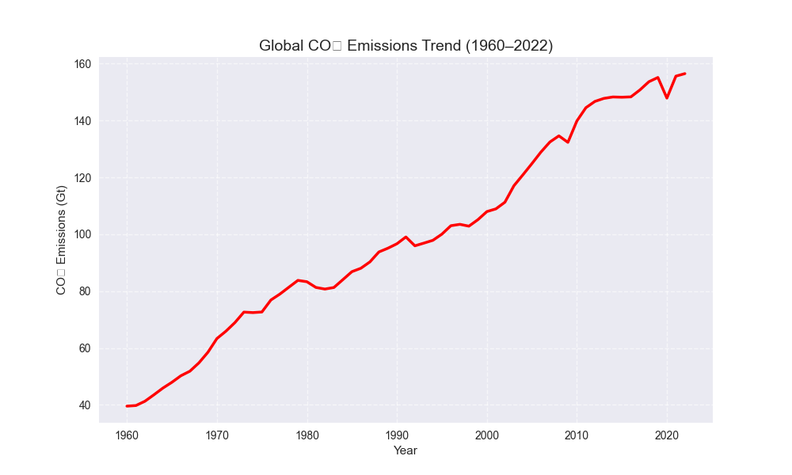
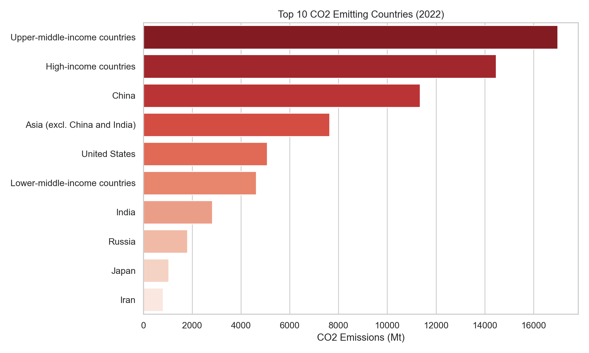
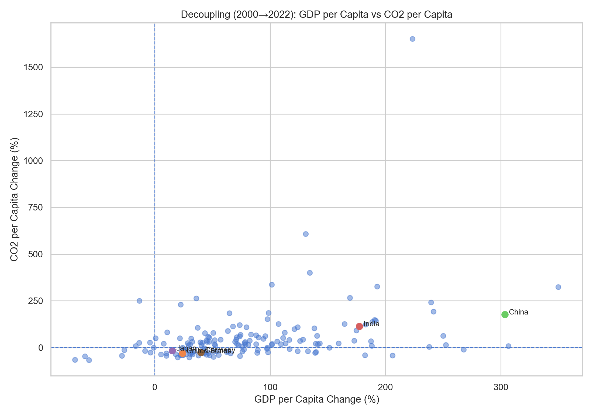
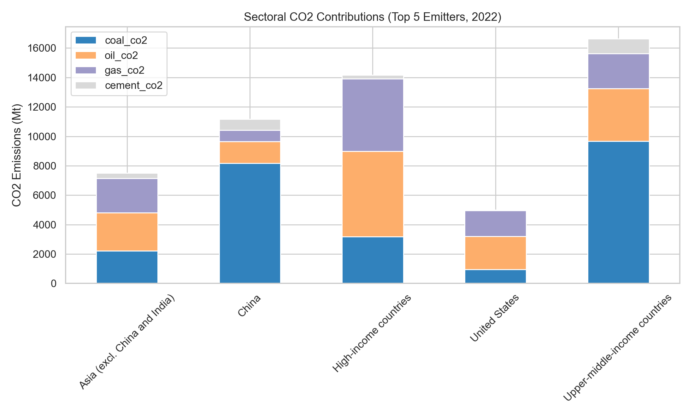
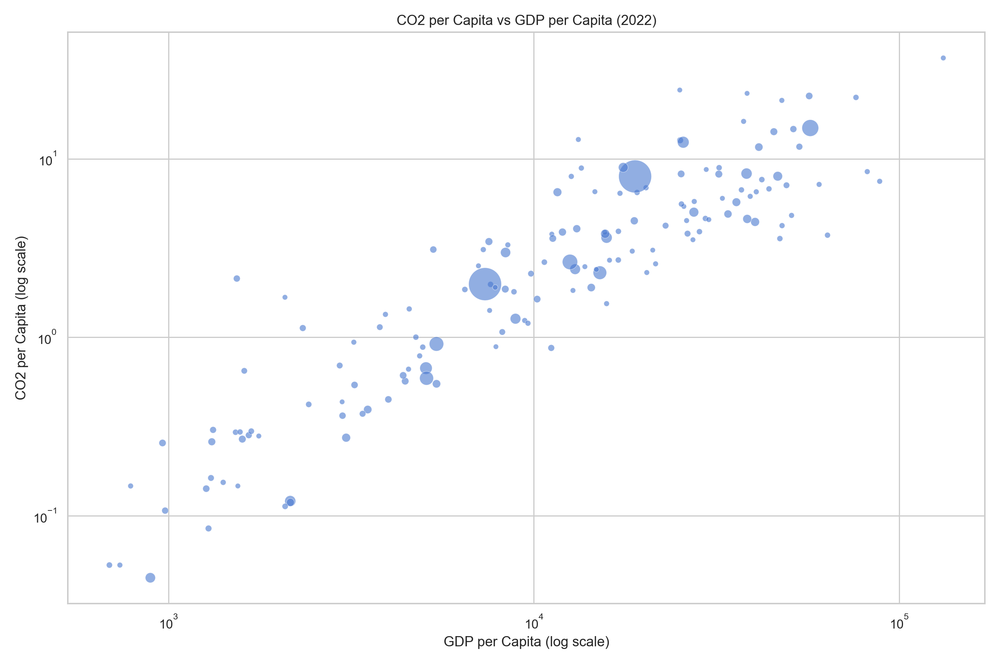

# 🌍 Global CO₂ Emissions Dashboard

**Author:** Thakur Shivamkumar Rajesh  
**Roll No:** 2312res963  
**Email:** thakur2312res963_iitp.ac.in

---

## 📌 Project Overview

This project analyzes global CO₂ emissions data from 2000–2022 and visualizes key insights using Python, Plotly, and Dash. It includes:

- Data cleaning and preprocessing
- Exploratory Data Analysis (EDA)
- Advanced visualizations
- Interactive dashboard

The goal is to help understand global CO₂ trends, top emitters, and decoupling of GDP and emissions.

---

## 🗂 Project Structure

Global_CO2_Emissions_Dashboard/
│
├── preprocess.py # Data cleaning & preprocessing
├── run_full_pipeline.py # Runs full project pipeline
├── global_co2_EDA.py # Main EDA scripts
├── eda_advanced.py # Advanced EDA & visualizations
├── dashboard_full.py # Interactive Dash dashboard
├── cleaned_co2.csv # Cleaned dataset
├── charts/ # Generated graphs/images
├── requirements.txt # Python dependencies
├── README.md # Project documentation
└── .gitignore # Files to ignore in Git

---

## 📊 Key Graphs / Visualizations

The project generates the following **5 main graphs**:

1. **Global Trend of CO₂ Emissions**  
   

2. **Top CO₂ Emitters (2022)**  
   

3. **Decoupling GDP & CO₂ Emissions**  
   

4. **Sectoral CO₂ Emissions Top 5 (2022)**  
   

5. **CO₂ vs GDP Bubble Chart (2022)**  
   

> ⚡ Note: All charts are saved in the `charts/` folder and can be regenerated by running the EDA scripts.

---

## 🚀 How to Run the Project

### 1. Clone the repository

```bash
git clone https://github.com/James-cyber101/Global_CO2_Emissions_Dashboard.git
cd Global_CO2_Emissions_Dashboard
